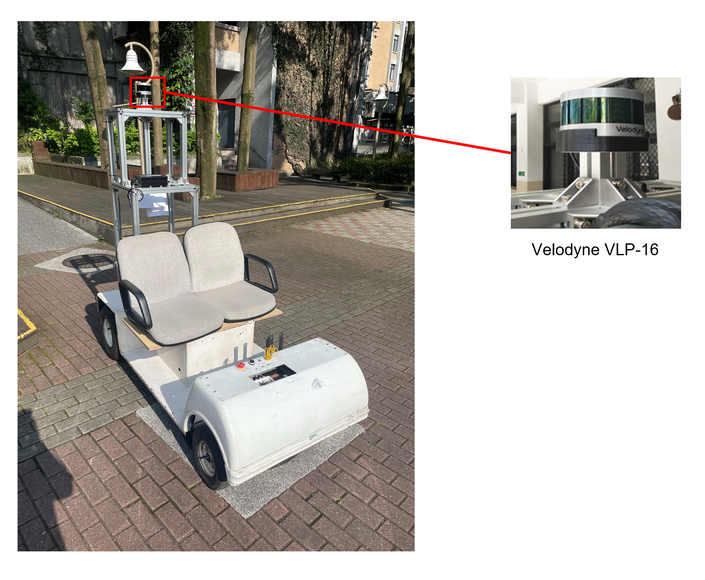

# Lidar Super-resolution

This repository contains code for lidar super-resolution with ground vehicles driving on roadways, which relies on a driving simulator to enhance the apparent resolution of a physical lidar. To increase the resolution of the point cloud captured by a sparse 3D lidar, we convert this problem from 3D Euclidean space into an image super-resolution problem in 2D image space, which is solved using a deep convolutional neural network. By projecting a point cloud onto a range image, we can efficiently enhance the resolution of such an image using a deep neural network. We train the network purely using computer-generated data (i.e., CARLA simulator). [A video of the package can be found here](https://youtu.be/rNVTpkz2ggY).

# Dependency

The package depends on Numpy, Tensorflow-keras, and ROS. ROS only is used for visualization.

# Data Collection
我們使用實驗室自製的高爾夫球車在校內收集資料作為Dataset設備實體如下圖所示
<p align='center'>

</p>
<p align='center'>
    
</p>

# Data Download
[Download the demo data]([https://drive.google.com/drive/folders/1oPNyeNW8yeBrWHMWRlYCT_e4tfMPzLKO?usp=sharing](https://drive.google.com/drive/folders/1hser570w48A2YVjj46V8xKqU-Ne7v5k4?usp=sharing)) into your ```Documents``` folder in your home directory.

# Demo

## Cite 

Thank you for citing [our paper](./docs/paper.pdf) if you use any of this code: 
```
@inproceedings{superresolution2020shan,
  title={Simulation-based Lidar Super-resolution for Ground Vehicles},
  author={Shan, Tixiao and Wang, Jinkun and Chen, Fanfei and Szenher, Paul and Englot, Brendan},
  journal={arXiv preprint arXiv:2004.05242}
  year={2020}
}
